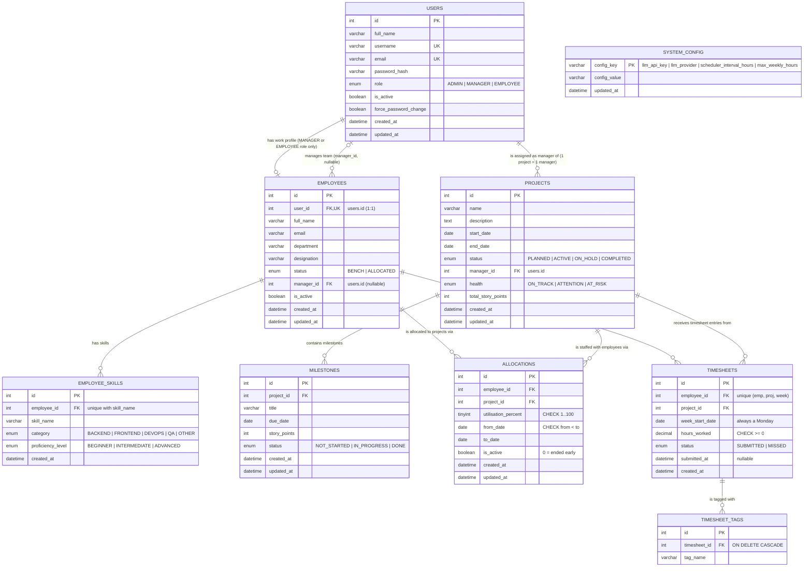

# PRM Tool — ER Diagram

**USERS** holds all system actors — a single user has one of three roles: `ADMIN`, `MANAGER`, or `EMPLOYEE`.
**EMPLOYEES** holds the work profiles for both `MANAGER` and `EMPLOYEE` role users. `ADMIN` users have no employee profile.

`employees.manager_id` and `projects.manager_id` both reference `users.id`.
A project has exactly **one** assigned manager. An employee may or may not have a manager assigned yet (nullable).

**Many-to-many relationships** are resolved through junction tables:
- `EMPLOYEES` ↔ `PROJECTS` → via `ALLOCATIONS` (1 employee can be allocated to many projects; 1 project can have many employees)
- `EMPLOYEES` ↔ `PROJECTS` → via `TIMESHEETS` (1 employee logs time against many projects; 1 project receives timesheets from many employees)

