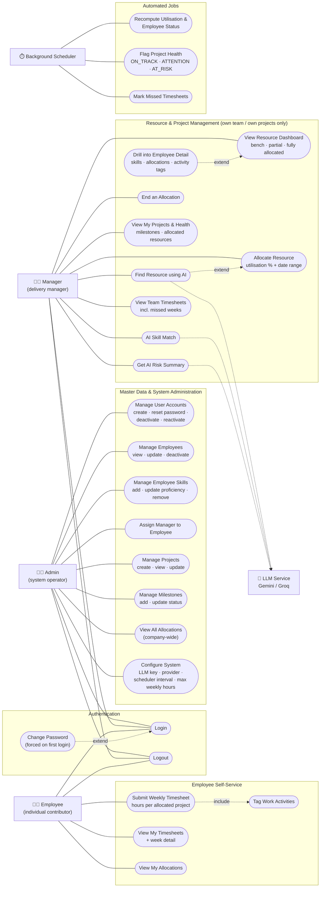

# PRM Tool — Use Case Diagram

Three human actors (Admin, Manager, Employee) plus two system actors (Background Scheduler
and the external LLM service).

Key rules attached to use cases (enforced server-side):

| Use case | Rule |
|---|---|
| Login | Inactive users are rejected; `force_password_change` redirects to Change Password |
| Create User Account | Username and email unique; password ≥ 8 chars, 1 uppercase, 1 number; MANAGER/EMPLOYEE roles also get an employee profile |
| Allocate Resource | Total overlapping utilisation ≤ 100%; from < to; project must be ACTIVE or PLANNED; employee must be on the manager's team |
| End Allocation | Only the project's manager can end it; employee status recomputed (BENCH if nothing remains) |
| Deactivate Employee | Ends all active allocations today, blocks the linked login, preserves history |
| Submit Timesheet | Only for allocated projects that week; hours per project ≤ allocation% × max weekly hours; total ≤ max weekly hours; no duplicates; no future weeks |
| AI Skill Match | Candidates filtered by free capacity first; only qualified employees sent to LLM; results are recommendations only |
| AI Risk Summary | Built from milestone status, allocations, and recent timesheet hours; output is a plain-English risk paragraph |
